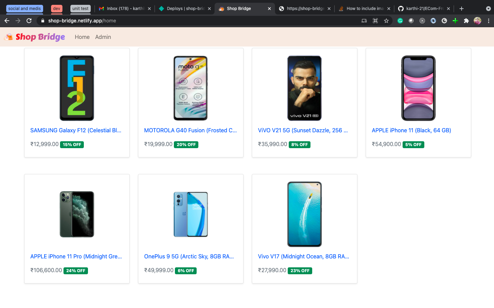
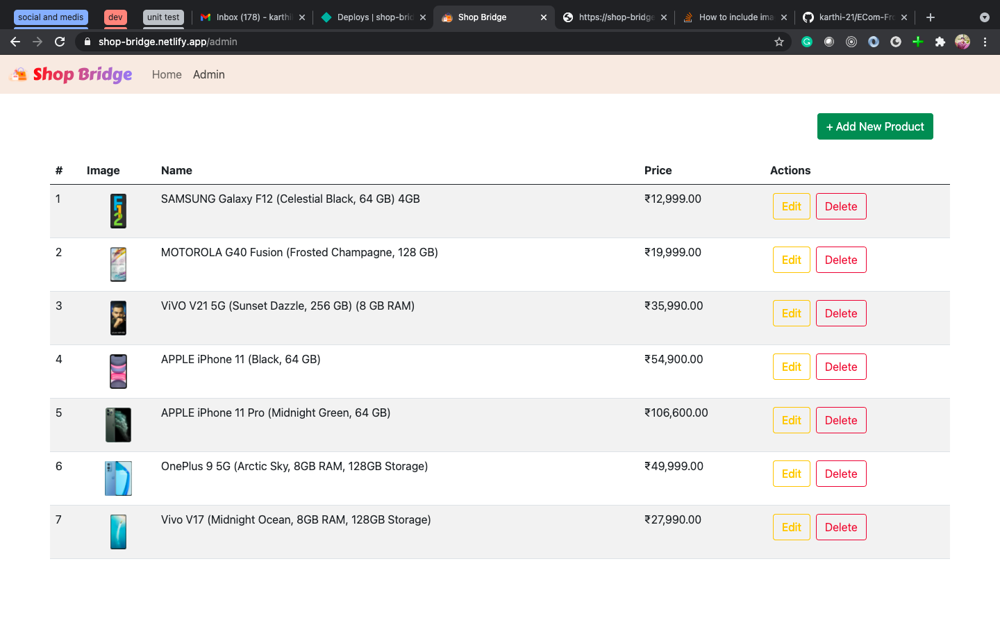
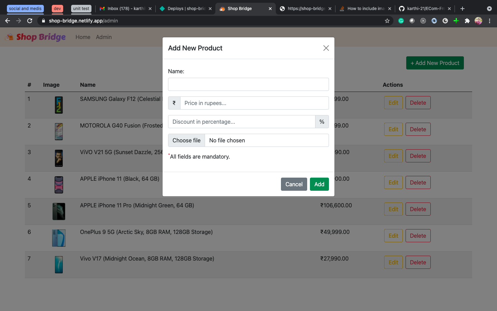
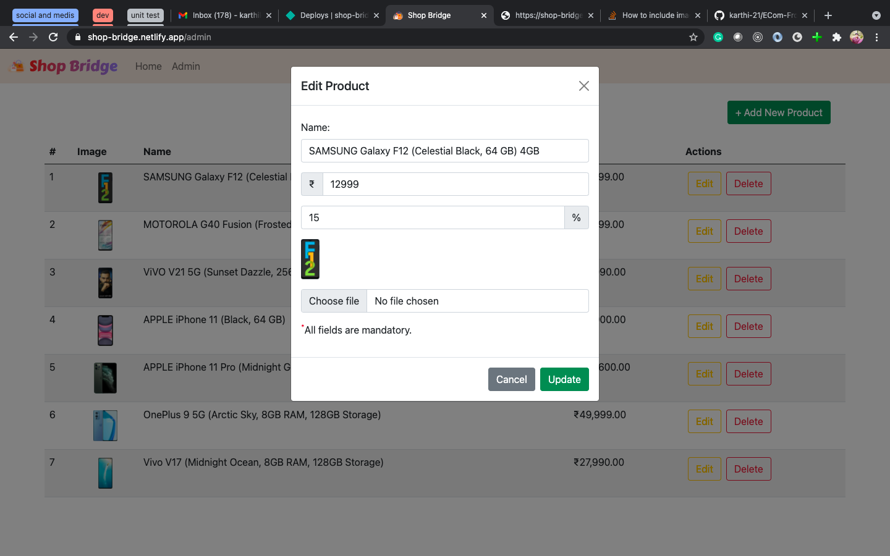
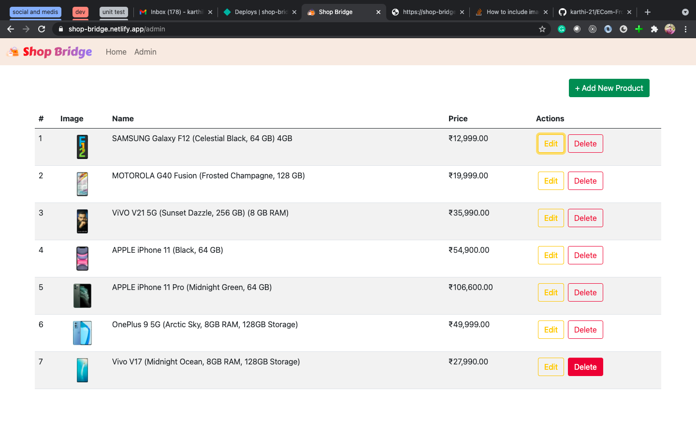
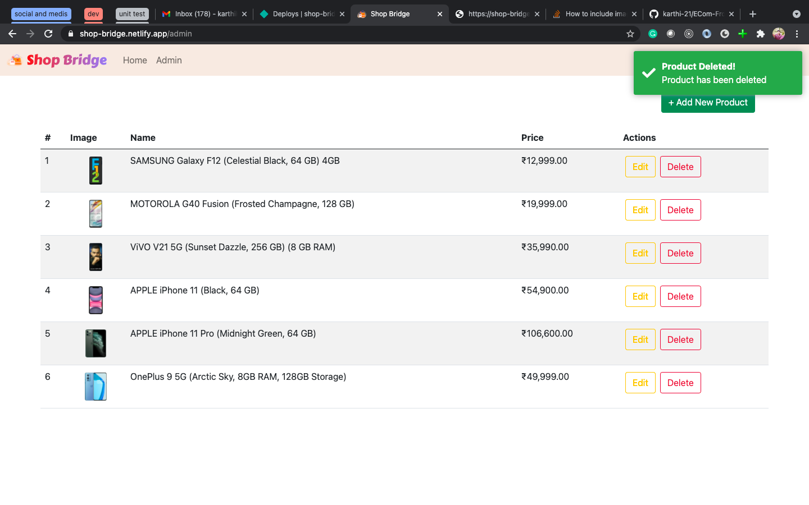
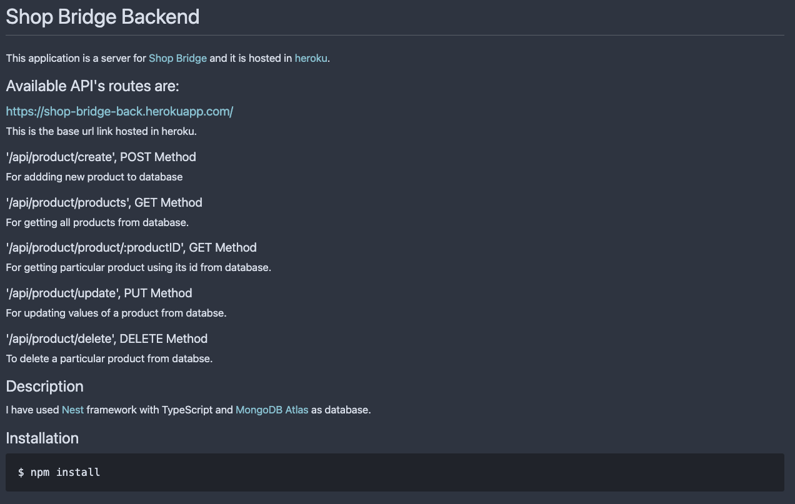

# [ShopBridge](https://shop-bridge.netlify.app/home)

This project was generated with [Angular CLI](https://github.com/angular/angular-cli) version 12.0.0. It is an ecommerce modal where just created to do some CRUD operations.

This is the url for live example [https://shop-bridge.netlify.app](https://shop-bridge.netlify.app). It is deployed in netlify with continous deployment from github integration.

## Home Page

## Admin Page

## Add New Product Modal

## Edit Product Modal

## Delete Button

## After Deletion

# Backend hosted on [HEROKU](https://dashboard.heroku.com/)

The base url of the hosted backend server api is [https://shop-bridge-back.herokuapp.com/api](https://shop-bridge-back.herokuapp.com/api). Code for backend is in github repo [Shop Bridge Backend](https://github.com/karthi-21/ECom-back) and deployed using continous deployemnt.

## Development server

Run `ng serve` for a dev server. Navigate to `http://localhost:4200/`. The app will automatically reload if you change any of the source files.

## Build

Run `ng build` to build the project. The build artifacts will be stored in the `dist/` directory. Use the `--prod` flag for a production build.

## Running unit tests

Run `ng test` to execute the unit tests via [Karma](https://karma-runner.github.io).
